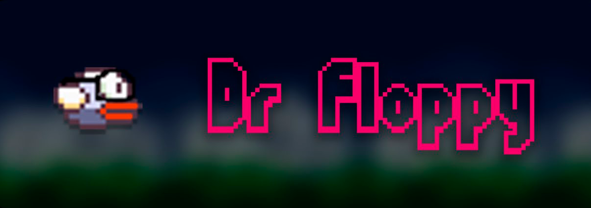

# MyFirstGame - Dr. Floppy

## Conteúdos

- [MyFirstGame - Dr. Floppy](#myfirstgame---dr-floppy)
  - [Conteúdos](#conteúdos)
  - [Introdução](#introdução)
    - [História:](#história)
    - [Um pouco da Gameplay:](#um-pouco-da-gameplay)
    - [Links](#links)
  - [Meu processo](#meu-processo)
    - [Feito com](#feito-com)
    - [Lógica](#lógica)
    - [Notas finais](#notas-finais)
    - [Créditos](#créditos)

## Introdução
Esse é o projeto MyFirstGame feito por mim, no final do 1º Período. O MyFirstGame consiste em um jogo feito em Basic no App Game Kit(AGK).

### História:
Dr.Floppy é um pássaro-doutor de I.A do Insituto Federal de Goiás. Ele se atrasou paro o seu seminário e agora se aventura por um atalho perigoso para chegar à tempo para a sua palestra.

### Um pouco da Gameplay:

### Links

- Vídeo no Youtube: [https://youtu.be/_UWGsgJhqIo](https://youtu.be/_UWGsgJhqIo)
- Site do App Game Kit: [https://www.appgamekit.com](https://www.appgamekit.com)

## Meu processo

### Feito com

- Visual Basic
- App Game Kit

### Lógica

- A Gameplay é idêntica ao Flappy Bird original
- A medida que o Dr. Floppy avança, as músicas vão mudando
- Dr. Floppy sabe dar cambalhotas!
### Notas finais

Este foi um dos projetos mais divertidos que já fiz na faculdade. Os bugs, as gambiarras de chernobyl e as gargalhadas que dei ao me deparar com tais situações tornaram o meu processo de aprendizado muito divertido. Este projeto servia como projeto integrador das matérias de: 
 - Construção de Algoritmos
 - Laboratório de Programação

### Créditos

- Nguyễn Hà Đông, o Criador do Flappy Bird
- Undertale, de onde eu peguei as músicas
- Tech With Tim, que me providenciou as [sprites](https://github.com/techwithtim/NEAT-Flappy-Bird/tree/master/imgs)

